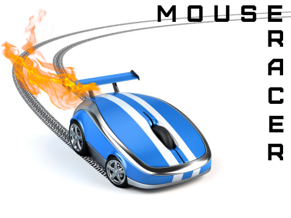
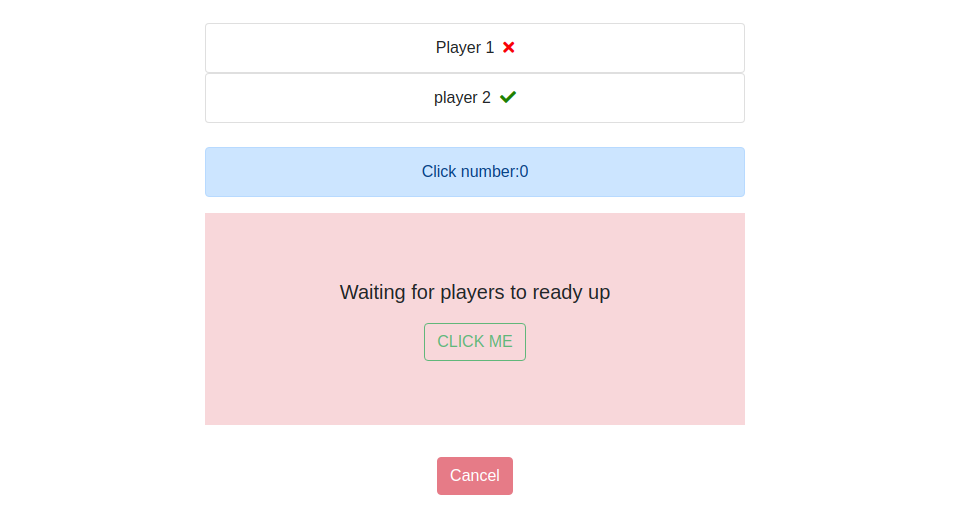

[](https://api.travis-ci.org/nejdetkadir/mouse-racer)
[](https://www.codacy.com/gh/nejdetkadir/mouse-racer/dashboard?utm_source=github.com&amp;utm_medium=referral&amp;utm_content=nejdetkadir/mouse-racer&amp;utm_campaign=Badge_Grade)

# mouse-racer
When ready all players, game is starts. If you are best mouse racer, i am sure you will win, Enjoy it!



### Screenshot from application


# Project setup
### Prerequirites
- NodeJS (>=10.x)
- npm

### Installation
Clone repo and install dependencies
``` bash 
$ git clone https://github.com/nejdetkadir/mouse-racer.git
```
``` bash 
$ cd mouse-racer
```
``` bash 
$ npm install && bower install
```
- If you want to use localhost or any server, you must change url from /public/javascripts/controller/indexController.js:14
```javascript
const url = 'https://mouse-racer.herokuapp.com'; 
``` 

# Demo
[Live demo on Heroku](https://mouse-racer.herokuapp.com/)

# LICENSE
This application is licensed under the Apache-2.0 license.
